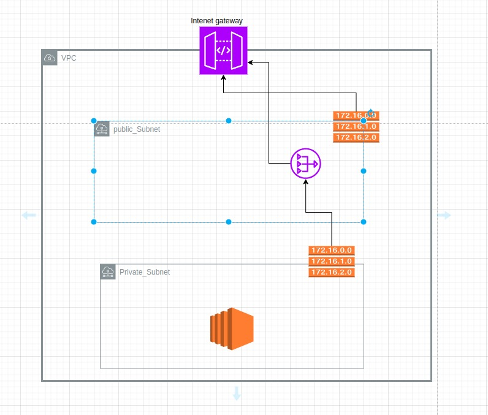
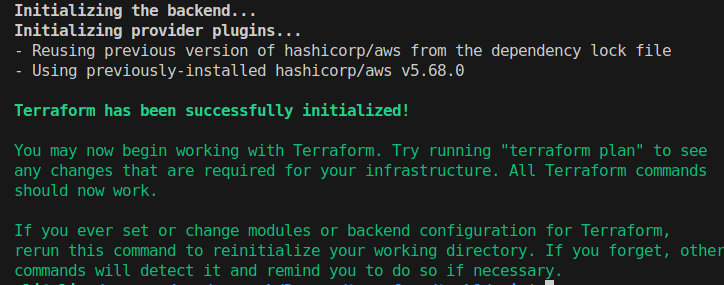
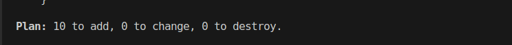
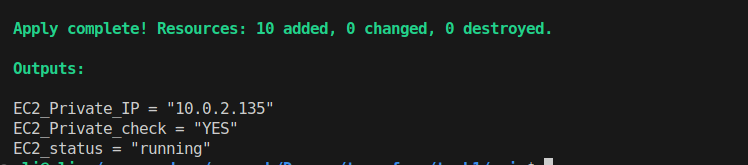

# Provisioning Infrastructure using Terraform [Task 1]


- What is Terraform ??

   Terraform is an infrastructure as code tool that lets you build, change, and version infrastructure safely and efficiently. This includes low-level components like compute instances, storage, and networking, as well as high-level components like DNS entries and SaaS features.

  ## Content
   - Task overview
   - Preqreuests
   - Insallation
   - Soluation


  ## Task overview
  
   - Task Details:
      - Apply this Digram
      - create VPC it manually from console and use it as  data  source select the vpc using vpc name
      - Make Sure that your EC2 is private 
      - output EC2 private IP and the state 
      - all resource should be have tag
      - use tfvars file to create Production and dev enviroment 
      - all values should be as Variable

  ## Preqreuests
     - AWS Account
     - Knowing At least these concepts in cloud
        - Region and avalablity zones
        - IAM service
        - VPC
        - Subnet
        - Route Table
        - Internet gateway
        - Nat Gateway and Elestic IP

  ## Insallation
    - Follow thses command
    ```
       curl -fsSL https://apt.releases.hashicorp.com/gpg | sudo apt-key add -

       sudo apt-add-repository "deb [arch=amd64] https://apt.releases.hashicorp.com $(lsb_release -cs) main"

       sudo apt install terraform

       terraform --version

    ```
 


  ## Soluation
   
   ### Step 1: Prepare the environment
   - Create Access key
       - Sign in your AWS account
       - Search for IAM service and select it
       - navigate to users in the left bar
       - create new user 
       - add perrmissions for this user
       - navigate to credentioals for this user 
       - create secret key 
       - before save , copy your access key and secret access key 
   - Find the Region that need to work on it 
   - Create main directory
      ```
      mkdir terraform_task
      ```
   - Create tf file 
      ```
         cd terraform_task
         touch main.tf
       ```
   - Create variable.tf 
      ```
       cd terraform_task
       touch variable.tf
      ```
   - Create The files that need tp pass it for appling like production or    development or test and so on , in this case i will create two files one for production and the other for development
      ```
       cd terraform_task
       touch prod.tfvars dev.tfvars
      ```
   ### Step 2: Write the code
   - To Use Terraform dynamiccly must use the variable Feature so we create variable.tf file to store all variables that need it in th resoures 
   - The most Important Thing is the Provider without it can't terraform work as this determine what is the provider aws or Azure or GCA or ... and also determine the region in this provider
   It is like this

     ```
       provider "Provider Name" {
         region = "your choosen region"
         access_key = "your access key"
         secret_key = "your secret key"
       } 
     ```
     - Note Must store all the dynamic value as a variable
    
   - Create VPC manaually 
      - search in console for VPC and select it 
      - Create one with name

   - Create in the main.tf data source for this VPC to use it in another resources like this

         data "aws_vpc" "Name" {

          tags = {Name = "your_vpc_name"}

         }


   - Create the Gateway
   - Create Public and Private Subnet
   - Create Elestic IP for The Nat Gateway
   - Create Nate Gateway for Private Subnet
   - Create route table for public subent and associate with public subnet
   - Create route table for private subent and associate with private subnet
       - note the route table for private subent link with Nat Gatway and then associat with private subnet
   - Create Data source for AMI to can get the AMI image id for the EC2 instance
   - Create EC2 instance 
   - Create output to print the instance status and check for this instance is private or public
   - Create the tfvars file and put values for each variable used in the main.tf file

   - Note the Varible that used in your code used in two way 
     - in the same file like this
         ```
           variable "variable_name" {
              type = variable type like string , number , boolean,..
              description = "variable description"
              default = "default value"
           }
         ```     
         all of the attribute optional execpt the type required
     - The Second way is to seprate all variable in seprate file
       - create it in the root inside the main.tf with the same extention like variable.tf
       
   ### Step 3: Initalization and Apply
   - After Finish the Code , you must initialize it and then create plan and apply this plan so follow this code
   - apply this code in the root directory that include the main.tf file

   ```
      terraform init
      terraform plan -var-file your_file_name.tfvars
      terraform apply -var-file your_file_name.tfvars
   ``` 
   - terraform init : this command to install the provider an the state
   - terraform plan : this command use to :
      - compare the current state and the disered state
      - create plan that will executed or applied
   - terraform apply : this command used execute this plan
      - note this command create also plan then apply it 
      - this command need approval to execute this plan => keywork [yes or  no] 
      - You can force this command to apply without approval as this is usefal in the automation with this command
      ```
        terraform apply -var-file your_file_name.tfvars -auto-approve
      ```
   - .tfvars : is a file that contains the value of the variables
      - this file is like this
           
             region = "your_region"
             access_key = "your-access_key"
             secret_key = "your_secret_key"
             and so on .....
             

   - The Output for these command 
      - init command

      

      - plan command

      

      - apply command

      

 
  ## Thanks
